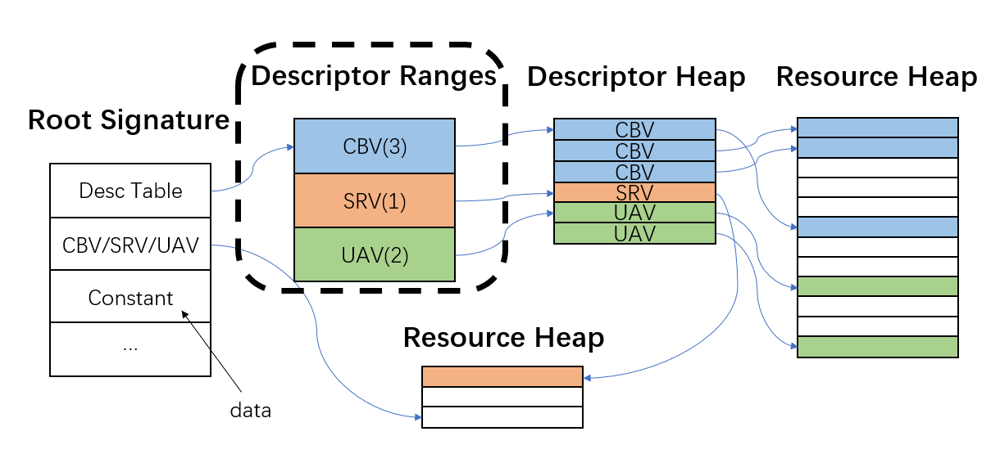

# day day up

## root signature

1. 访问根签名中的Constant，效率最高，耗时1个单位；
2. 其次，可以直接将CBV/SRV/UAV绑定到根签名上，需要通过view，访问heap中的数据，耗时2个单位；
3. 可以将一堆view放到一个descriptor table中，通过descriptor range管理table，shader通过先访问table，再通过view访问heap中的数据，耗时3个单位；虚线框出来的应该是抽象出来的一层，实际上应该不需要额外访问开销。
4. Vertex Buffer View、Index Buffer View、Stream Output View 以及直接存储在 Root Signature 的 CBV\SRV\UAV\Sampler 描述符，D3D12 在设计初期对于上述资源还是要求使用 GPU 描述符堆的，后来为了 API 使用方便，才将这些细节屏蔽在了 D3D12 Runtime 中。也正因如此，我们使用起来可以当作不需要 Descriptor Heap ，但是认知上我们知道其实只是把细节隐藏在 D3D12 Pipeline 内部罢了。[参考](https://zhuanlan.zhihu.com/p/427864585)

